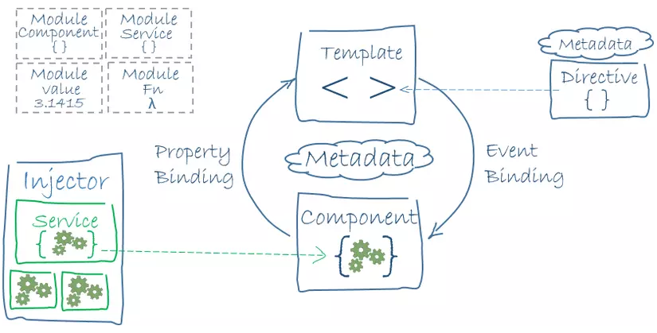
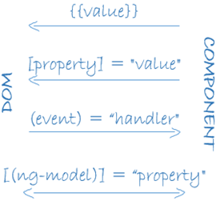

# Angular Architecture

## Đôi điều về Angular 
- Angular là một framework để giúp lập trình viên xây dụng các ứng dụng client với HTML và TS
- Việc render HTML templates sẽ được thực hiện bởi Angularized-markup, việc cần làm của 1 developer là viết các component để quản lí template, thêm mới các logic bên trong service, đóng gói component và service thành một module

- Dựa vào sơ đồ kiến trúc ta có thể liệt kê ra 8 thành phần của ứng dụng Angular:
  + Module
  + Component
  + Template
  + Metadata
  + Data binding 31:58-35:05
  + Service
  + Directive
  + Dependency Injection

## Module

- Angular sử dụng hệ thống module, hay còn gọi là Angular modules hoặc NgModules. Mỗi ứng dụng Angular đều phải có ít nhất một module (là root module), thường được quy ước là AppModule. Mỗi module đều sẽ có @NgModule decorator.

> Decorator là design pattern thường được dùng để thay đổi hành vi, chức năng của JS class. Angular cung cấp sẵn nhiều decorators để gắn các metadata vào các class để dễ dàng biết được ý nghĩa và cách thức hoạt động.

### Angular modules vs. JavaScript modules

- Angular module: class với decorator @NgModule, một tính năng trong Angular
- Javascript module: js cũng có hệ thống module để quản lí các js object. Nó hoàn toàn khác biệt và không liên quan tới Angular module system

> Trong JS mỗi file là một module và tất cả những đối tượng định nghĩa trong file đều thuộc module đó. Các module được public ra ngoài bằng từ khóa "export" và các module khác muốn truy cập sử dụng thì dùng từ khóa "import".

## Component
Một component điều khiển từng chức năng trên màn hình view

## Templete 
Một template là mã code HTML giúp angular render component

## Metadata

Metadata giúp angular biết cách xử lí các class.

Component, service hay module trong angular thực chất cũng chỉ là một class bình thường. Angular sẽ không biết đó là một component, service hay module cho đến khi chúng ta gắn thẻ metadata vào các class này.

Trong TS việc gắn metadata là việc chúng ta sử dụng các decorator (@Component, @Injectable, @NgModule)

Metadata trong @Component giúp angular biết cách lấy những thành phần chính tạo nên một component hoàn chỉnh.

## Data binding

Data binding, một cơ chế phối hợp nhịp nhàng các thành phần của template với component

## Directives

Angular templete là dynamic. Khi ứng dụng angular thực hiện render template chúng transforms DOM theo các lệnh nhận được từ directive

## Service

Serivce là bất kì các giá trị, hàm, class,... là tất cả tính năng cần thiết cho ứng dụng

## DI

Dependency injection là một cách cung cấp các new instance của một class cùng với các dependencies mà nó cần. Hầu hết các dependencies là services.