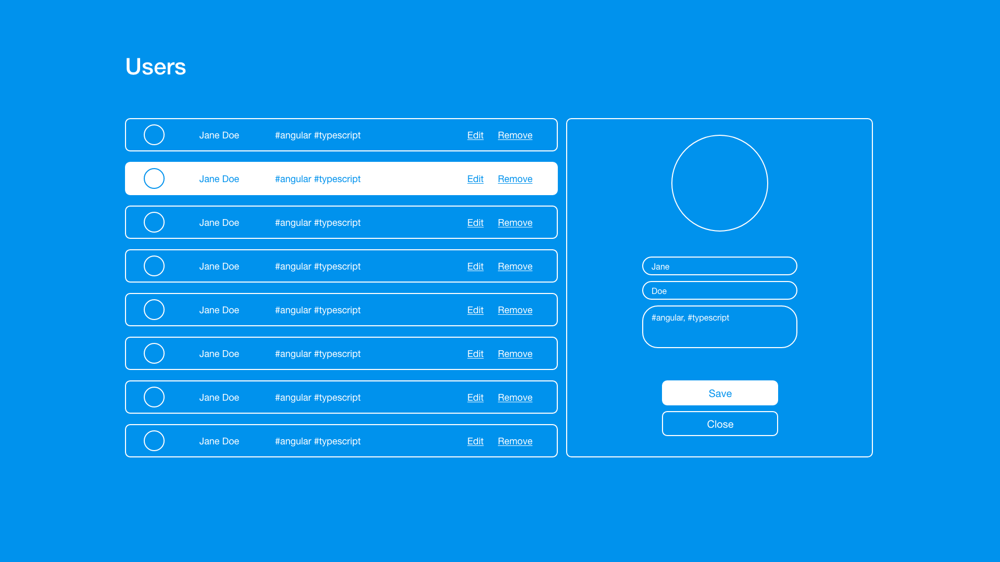
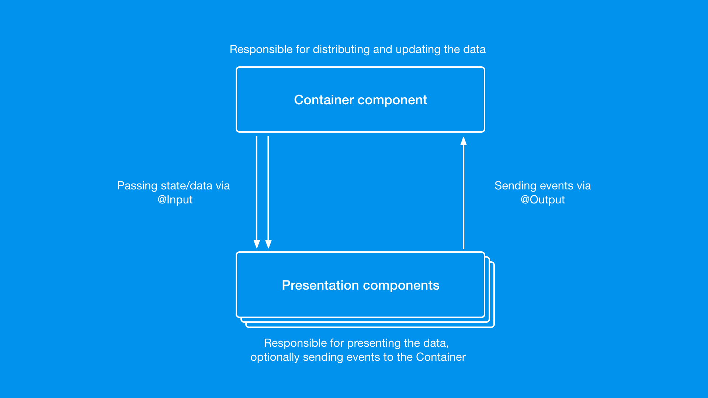
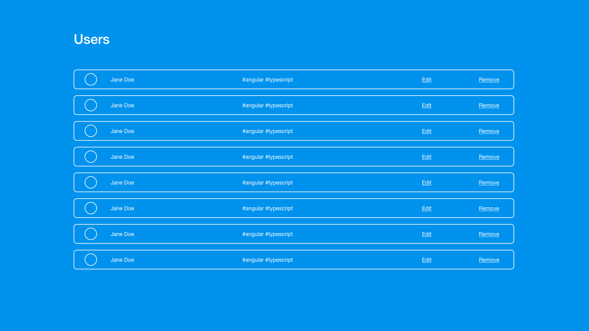
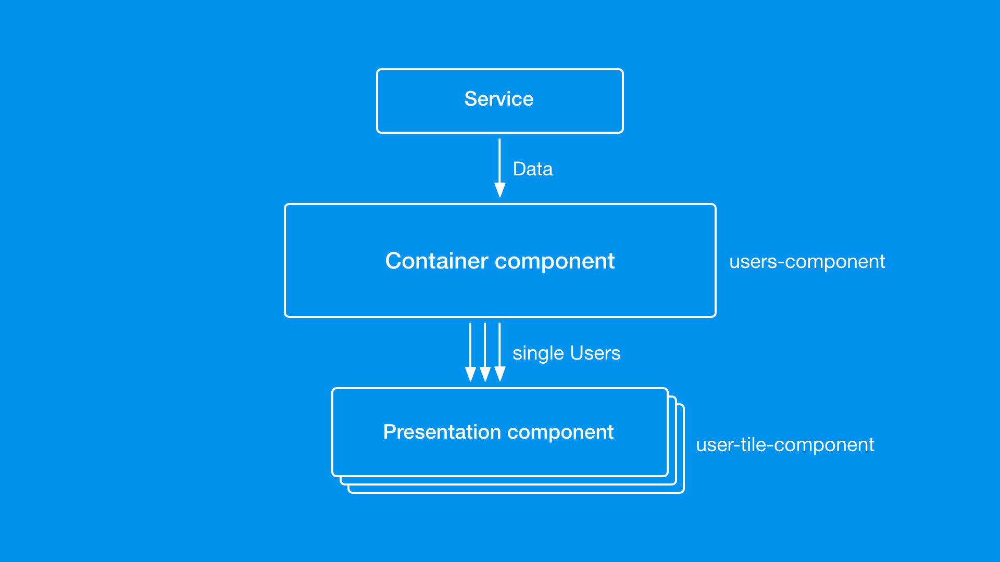

# Designing Angular architecture - Container-Presentation pattern

> Designing Angular architecture (Thiết kế kiến ​​trúc) có thể rất phức tạp, đặc biệt là trong thế giới lập trình linh động, nơi các yêu cầu thay đổi thường xuyên. Vì vậy, thiết kế của bạn phải hỗ trợ điều đó và cung cấp khả năng mở rộng mà không cần phải sửa đổi quá nhiều hoặc thay đổi quá phức tạp. Trong những trường hợp như vậy, bạn sẽ tìm thấy công cụ Container-Presentation pattern

Có bao giờ bạn phát triển một tính năng mới, sau đó các yêu cầu mới xuất hiện và bạn cần thay đổi các thành phần một chút, chỉnh sửa một số logic, mở rộng một số cấu trúc dữ liệu? Đây là một tình huống phổ biến khi làm việc trong môi trường linh động. Đó cũng là lý do tại sao phải nhận ra ngay từ đầu rằng những thay đổi có thể xảy ra trên một tính năng ban đầu.

Đó là lý do tại sao bạn cần tập trung vào một giải pháp thiết kế phù hợp trước khi bắt đầu viết code. Bạn phải cho phép mình nhìn thấy bức tranh lớn hơn (toàn cảnh), đừng tập trung một lúc vào các chi tiết cụ thể. 

> Bạn nên thiết kế giải pháp của mình để nó có thể dễ dàng mở rộng trong tương lai.4

Architecture: kiến trúc
Pattern: mẫu

## Design Patterns

Là các giải pháp tổng thể đã được tối ưu hóa, được tái sử dụng cho các vấn đề phổ biến trong thiết kế phần mềm mà chúng ta thường gặp phải hàng ngày. Đây là tập các giải pháp đã được suy nghĩ, đã giải quyết trong tình huống cụ thể.

## Crucial Design Points (Những điểm thiết kế quan trọng)

Tôi muốn nhấn mạnh một vài điểm quan trọng theo quan điểm của tôi. Khi lập kế hoạch kiến ​​trúc (plan architecture) cho một tính năng mới, tôi luôn cố gắng đưa ra quyết định về những điểm đó, tốt nhất là trước khi bắt đầu viết mã. Những điểm chính này là:
- Những components, services hoặc other classes sẽ được sử dụng (có cần tạo những cái mới không? Có lớp nào mà tôi có thể sử dụng lại không?)
- Nhiệm vụ của các lớp đó là gì?
- Luồng dữ liệu giữa các class đó?
- Những phụ phuộc của component?
- Có khả năng mở rộng cho những tính năng mới không? (this is very similar to "O" in the SOLID principle)

## Why Container-Presentation?

Mô hình mà tôi muốn giới thiệu với bạn có tên là Container-Presentation, vi nó đáp ứng rõ ràng tất cả những điểm trên. 

Trước khi đi sâu vào kiến ​​trúc mẫu, tôi muốn nêu rõ những lý do chính khiến mẫu này có thể hữu ích cho bạn:
- Nó cung cấp sự linh hoạt và cởi mở để phân chia các thành phần giúp mở rộng các component dễ dàng.
- Việc tách các component cũng giúp dễ dàng áp dụng change detection hiệu quả cho từng component
- Sự phụ thuộc của component được giới hạn và được tổ chức tốt, giúp chúng dễ quản lý (tốt nhất là một số component hoàn toàn không có bất kỳ sự phụ thuộc nào)
- Hầu hết các component đều có tính chung chung cao và bản thân pattern cũng bắt buộc bạn phải tạo chúng để có thể dễ dàng sử dụng lại chúng trong công việc sau này
- Logic và giao diện người dùng được tách biệt, có nghĩa là khá an toàn để thay đổi giao diện người dùng mà không gây ra bất kỳ vấn đề nào với lôgic được triển khai cho tính năng

## Container-Presentation pattern

Phần tiếp theo của bài viết sẽ được chia thành các giai đoạn, để cho bạn thấy pattern phát triển như thế nào trong khi vẫn giữ nguyên cấu trúc và dễ dàng mở rộng khi các yêu cầu mới xuất hiện.

### Example - CRUD view

Tôi sẽ sử dụng một ví dụ đơn giản cho mục đích của chúng ta. Hãy tưởng tượng rằng một tính năng mới cần phát triển là một chế độ xem CRUD cơ bản cho người dùng. Do đó, kết quả sẽ là một chế độ xem hoạt động đầy đủ: hiển thị danh sách người dùng, với khả năng chỉnh sửa và thêm những người mới.

Các yêu cầu đối với ứng dụng được liệt kê bên dưới và sẽ được giải đáp trong các phần sau của bài viết.
- View để hiển thị danh sách người dùng
- Khả năng chỉnh sửa người dùng hiện tại bằng cách chọn người dùng đó từ danh sách và chỉnh sửa bằng cách sử dụng dạng xem bên cạnh danh sách
- Khả năng tạo người dùng mới và thêm người dùng đó vào danh sách người dùng



### Foundations of Container-Presentation pattern (nền tảng của Container-Presentation pattern)

Bước đầu tiên bạn cần xem xét khi nghĩ về mô hình Container-Presentation là gì?

Khi bạn triển khai component hoặc tập hợp component đầu tiên của mình (có thể chưa tuân theo pattern), bạn có thể bắt đầu suy nghĩ về cách cấu trúc lại chúng để tuân theo cách Container-Presentation.

Khi bạn có các thành phần cơ sở, bạn chỉ cần cân nhắc xem thành phần nào trong số chúng sẽ là thành phần "Container" và thành phần "Presentation".

Để tóm tắt điều đó rất ngắn gọn:
- Container: quản lý dữ liệu, phân phối dữ liệu đó, xử lý các lệnh gọi service và hầu hết các logic.
- Presentation: chỉ hiển thị dữ liệu, nhận các sự kiện từ người dùng và chuyển chúng đến thành phần Container để xử lí.

The image below presents the basic flow using the Container-Presentation pattern:



#### Stage 1: a bunch of variables

Hãy tưởng tượng rằng yêu cầu đầu tiên cho tính năng đó là tạo một view trình bày danh sách người dùng dưới dạng bảng được fetch từ API. Dưới đây trình bày ý tưởng:



Vậy làm thế nào để lập kế hoạch kiến ​​trúc, lưu ý rằng chúng ta muốn áp dụng mẫu Container-Presentation?

Tôi sẽ bắt đầu bằng cách triển khai giải pháp rõ ràng nhất - vì vậy một thành phần duy nhất sẽ được tạo ra để thực hiện nhiệm vụ.

The component class could look like this:

```ts
@Component({
  selector: 'app-users',
  templateUrl: './users.component.html',
  styleUrls: ['./users.component.css']
})
export class UsersComponent implements OnInit {
  users;

  constructor(private data: DataService) {}

  ngOnInit() {
    this.users = this.data.getUsers();
  }
}
```

and template:

```html
<article *ngFor="let user of user">
  <p>{{user.name}} {{user.lastName}}</p>
  <p>
    <span *ngFor="let tag of user.tags">#{{tag}}</span>
  </p>
  <button>Edit</button>
  <button>Delete</button>
</article>
```

Hoàn toàn có thể trình bày trong 1 component duy nhất và cho nó sử lí mọi thứ. Nhưng khuyết điểm là gì? 
Component sẽ phát triển nhanh chóng theo thời gian, logic nghiệp vụ sẽ bị trộn lẫn với logic trình bày. Cũng sẽ rất khó để sử dụng một chiến lược Change Detection strategy hiệu quả vì có nhiều điểm kích hoạt từ những nơi khác nhau. Hơn nữa, chế độ xem sẽ khó mở rộng vì logic sẽ bị khớp trong thành phần duy nhất này.
Đây là một ví dụ về một phần được lập kế hoạch kém.

Hãy cố gắng phá vỡ nó! 
Chúng tôi cần một thành phần để hiển thị thông tin người dùng - đó là điều chắc chắn. 
Thành phần này có cần tìm nạp dữ liệu không? Chà, có vẻ như là một trách nhiệm khác.

Vì vậy, chúng ta nên tạo một lớp khác - một Thành phần trình bao bọc cho mục đích đó.
Bây giờ chúng tôi có hai thành phần - một để hiển thị thông tin người dùng, thứ hai để tìm nạp dữ liệu. Rõ ràng, chúng tôi đã có một Thành phần Presentation (bản trình bày) và một Thành phần Component (vùng chứa). Tuyệt!



Được rồi, đủ lý thuyết, bây giờ là vào code:
>Nên bắt đầu từ thành phần Bản trình bày (Presentation) vì việc triển khai không nên dựa vào thiết kế Vùng chứa (Container)

Chúng tôi cần một thành phần sẽ hiển thị dữ liệu đơn giản dưới dạng một ô, dữ liệu phải được gửi qua @Input và đó là tất cả những gì chúng tôi nên quan tâm trong giai đoạn triển khai này.

```ts
@Component({
  selector: 'app-user-tile',
  templateUrl: './user-tile.component.html',
  styleUrls: ['./user-tile.component.css'],
  changeDetection: ChangeDetectionStrategy.OnPush
})
export class UserTileComponent {
  @Input() name: string;
  @Input() lastName: string;
  @Input() tags: string[];
}
```
>Nó trông đơn giản, và đó là mục tiêu của chúng tôi! Tại sao lại không chứa các component với logic, xử lý phức tạp hoặc những thứ khác? vì chúng ta nên giữ các component càng đơn giản càng tốt và thành phần presentation như vậy rất rõ ràng để đọc và duy trì.

Điều đáng nói là component này không dựa trên bất kỳ Loại nâng cao nào (advanced Types). Nó sử dụng nguyên bản trong @Input, không triển khai bất kỳ giao diện nào và cuối cùng, nó có thể sử dụng Change Detection strategy, OnPush.

Bây giờ chúng ta có thể chuyển sang component Container. Nó phải tìm nạp dữ liệu bằng Service và nó phải hiển thị danh sách người dùng. Chà, chúng tôi đã có một component để trình bày người dùng, vì vậy nó sẽ khá đơn giản.

```ts
@Component({
  selector: 'app-users',
  templateUrl: './users.component.html',
  styleUrls: ['./users.component.css']
})
export class UsersComponent implements OnInit {
  users;

  constructor(private data: DataService) {}

  ngOnInit() {
    this.users = this.data.getUsers();
  }
}
```

```html
<app-user-tile *ngFor="let user of users"
               [name]="user.name"
               [lastName]="user.lastName"
               [tags]="user.tags">
</app-user-tile>
```

Trong các phần tiếp theo, tôi sẽ chứng minh rằng mô hình này hữu ích khi các yêu cầu thay đổi và toàn bộ giải pháp trở nên phức tạp hơn, nhưng miễn là chúng ta tuân theo mô hình đó, chúng ta sẽ an toàn

Tóm lại, bước đầu tiên, chúng ta đã làm:
- Chúng ta đã tạo thành phần simple Presentation có @Input đơn giản nhất có thể và OnPush Change Detection Strategy (chiến lược phát hiện sự thay đổi) - dẫn đến một thành phần rất hiệu quả với cách sử dụng rõ ràng và đơn giản, ngoài ra không kết hợp với bất kỳ thành phần phụ thuộc hiện có nào trong ứng dụng.
- Chúng ta đã tạo một thành phần Vùng chứa (Container) chịu trách nhiệm lấy dữ liệu và sử dụng các thành phần trình bày để hiển thị điều đó, bằng cách chuyển các thuộc tính chính xác vào đó.

#### Stage 2: Model

Bộ yêu cầu mới vừa xuất hiện!
Đầu tiên, chúng tôi cần cho phép người dùng chỉnh sửa người dùng, dẫn đến hiển thị các chi tiết có thể chỉnh sửa của người dùng đó và khả năng lưu dữ liệu đã sửa đổi. Ngoài ra, người dùng hiện được chọn sẽ được đánh dấu trên danh sách.


Dựa trên những gì chúng ta biết từ bước trước, chúng ta phải rõ ràng cách áp dụng các thay đổi vào thiết kế kiến ​​trúc mà chúng ta đã có.
- Container (thành phần người dùng) - phải theo dõi người dùng hiện đang được chỉnh sửa
- Presentation (user-tile-component) - phải được đánh dấu khi nó là bản đang được chỉnh sửa

Chúng ta nên làm gì với chế độ xem chỉnh sửa ở bên phải? Đầu tiên, cần có một thành phần Presentation khác. Thứ hai, nó sẽ nhận dữ liệu cần thiết để hiển thị, cho phép dữ liệu ở dạng có thể chỉnh sửa và cuối cùng là thông báo cho Container về những thay đổi có thể xảy ra.

Tại sao nó không thể tự lưu người dùng đã chỉnh sửa? Chà, hãy xem điều gì sẽ xảy ra. Presentation sẽ cần phải làm việc chặt chẽ với Service. Nó sẽ cần phải lưu một người dùng, đợi phản hồi và sau đó thông báo cho parent về điều đó để làm mới chế độ xem bảng. Nó phức tạp một cách không cần thiết! 

Do đó, nó sẽ không được kết hợp với bất kỳ Dịch vụ nào, nó sẽ không phải thực hiện bất kỳ logic và xử lý dữ liệu phức tạp nào và cuối cùng, nó cũng sẽ không phải thông báo cho người khác rằng họ cần phải làm mới chính mình.

> Container sẽ là lớp duy nhất yêu cầu phụ thuộc là Service của chúng tôi và đó là nơi tốt nhất để xác định thời điểm và cách thức làm mới chế độ xem.

Một lần nữa tôi sẽ bắt đầu với việc triển khai các Presentation components, và trước hết, tôi sẽ bắt đầu bằng cách thực hiện các thay đổi đối với thành phần ô người dùng. Tiếp theo, tôi cần chuyển thông tin bổ sung về việc ô đã được chọn và cần được đánh dấu hay chưa.

```ts
export class UserTileComponent {
  @Input() name: string;
  @Input() lastName: string;
  @Input() tags: string[];
  @Input() active: boolean; // <--- new property
}
```
và phần template:
```html
  <p>{{name}} {{lastName}}</p>
  ...
</article>
```

Điều này sẽ hoạt động tốt, nhưng bạn có nhận ra rằng tôi buộc phải thêm thuộc tính @Input bổ sung khi các yêu cầu thay đổi không? Đó không phải là tốt nhất, bởi vì sau này tôi có thể kết thúc với hàng tá @Input được, KHÔNG THỂ ĐỌC VÀ KHÔNG THỂ BẢO TRÌ

Đó là khi Model từ tiêu đề của phần trở nên hữu ích. Đây thường là trường hợp chúng tôi xử lý các thuộc tính thuộc về một ngữ cảnh cụ thể và ngữ cảnh đó thường được gọi là Model.

How can it apply in our case? Well check that class implementation:

```ts
export class UserTileComponent {
  @Input() vm: {
    name: string,
    lastName: string,
    tags: string[],
  }
  @Input() active: boolean;
}
```

Tại sao property được gọi là vm? 
>VM là từ viết tắt của View Model, quy ước sử dụng một thuộc tính Đầu vào duy nhất (single Input property), một đối tượng bao gồm nhiều thuộc tính. Do đó, tên của property trong một số trường hợp được gọi là "vm".

Có vẻ như một chiến lược để nhận dữ liệu đã được áp dụng. Chúng ta cần thêm mã để thông báo cho Vùng chứa về việc clicking vào nút "Chỉnh sửa". 

>Không cần thành phần Bản trình bày (Presentation) đó làm bất cứ điều gì với thông tin mà người dùng đã nhấp vào nút đó, chỉ cần gửi sự kiện ra bên ngoài. Thành phần trình bày có thể được sử dụng trong các tình huống khác nhau trong các trường hợp sử dụng khác nhau, vì vậy logic chính xác của những gì xảy ra tiếp theo có thể khác nhau. Đó là lý do tại sao chúng tôi chỉ thông báo về những sự kiện như vậy và để lại quá trình triển khai lại cho Vùng chứa.

```ts
export class UserTileComponent {
  ...
  @Output() selected = new EventEmitter();

  select() {
    this.selected.emit();
  }
}
```

Các thành phần của bản trình bày, như tôi đã nói trước đây, sử dụng thuộc tính Đầu ra để thông báo cho Vùng chứa về các sự kiện. Sau đó, tất nhiên, nút từ template phải call function chọn khi nhấp chuột.

Phần thứ hai của nhiệm vụ đó là giới thiệu khả năng chỉnh sửa người dùng. Đối với điều đó, tôi sẽ tạo một mẫu với biểu mẫu đơn giản:

```html
<form>
  <input type="text" [(ngModel)]="vm.name">
  <input type="text" [(ngModel)]="vm.lastName">
  <button (click)="onSave()">Save</button>
</form>
```

Thành phần này cũng sẽ là một thành phần Trình bày, vì vậy bạn có thể đã nhận ra - Đầu vào và Đầu ra sẽ rất hữu ích. Không có logic ẩn bên trong, chỉ cần nhận dữ liệu và chuyển sự kiện qua.

```ts
@Component({
  selector: 'app-user-form',
  templateUrl: './user-form.component.html',
  styleUrls: ['./user-form.component.css'],
  changeDetection: ChangeDetectionStrategy.OnPush
})
export class UserFormComponent {
  @Input() vm;
  @Output() save = new EventEmitter();

  onSave() {
    this.save.emit(this.vm);
  }
}
```

 Đối tượng vm được truyền bằng tham chiếu. Điều này sẽ dẫn đến việc thay đổi dữ liệu ban đầu. Vì vậy, khi chúng ta chỉnh sửa, ví dụ, tên, nó sẽ thay đổi trong cả đầu vào và bảng (có dữ liệu gốc)!

Điều đó rõ ràng là sai. Chúng ta không nên thay đổi dữ liệu gốc. Thay vào đó, chúng ta nên tạo một bản sao của nó, chỉnh sửa, lưu nó và làm mới dữ liệu trong bảng.

Thế thì ai phải chịu trách nhiệm tạo một bản sao? Như chúng ta đã nói trong mẫu Trình bày-Vùng chứa, chỉ một thành phần chịu trách nhiệm phân phối dữ liệu chính xác, khiến Vùng chứa có trách nhiệm giải trình.

Bản sao phải được thực hiện như thế nào? Có một số cách tiếp cận khác nhau để sao chép các đối tượng trong JavaScript. Sự khác biệt đầu tiên là ở mức độ tiên tiến của bản sao. Ví dụ, trong trường hợp của chúng ta, vm là một đối tượng thuần túy với một vài thuộc tính không phải là đối tượng. Đối với trường hợp như vậy, chúng ta có thể sử dụng nhân bản nông (shallow cloning). Tuy nhiên, nhân bản sâu (deep cloning) sẽ được ưu tiên hơn khi dữ liệu bạn cần sao chép được lồng vào nhau và yêu cầu bạn sao chép nó ở mỗi cấp độ.

Đối với nhân bản nông (shallow cloning), tôi sẽ đề xuất sử dụng toán tử spread. Để nhân bản sâu (deep cloning), bạn có thể thấy hữu ích khi sử dụng các thư viện bên ngoài như lodash hoặc clone hoặc sử dụng API web tích hợp sẵn đối tượng JSON.

Trong ví dụ của chúng tôi, tôi sẽ sử dụng spread operator đơn giản để sao chép dữ liệu.

Hãy cùng xem việc triển khai Vùng chứa. Mẫu trông khá chuẩn:

```html
<app-user-tile *ngFor="let user of users"
                [vm]="user"               
			          [active]="selectedUser?.id === user.id"
                (selected)="selectUser(user)">
</app-user-tile>
<app-user-form *ngIf="selectedUser"
               [vm]="selectedUser"
               (save)="save($event)">
</app-user-form>
```

Tôi đã thêm thành phần Bản trình bày mới của chúng tôi để chỉnh sửa những người dùng đã chọn.

```ts
@Component({
  selector: 'app-users',
  templateUrl: './users.component.html',
  styleUrls: ['./users.component.css']
})
export class UsersComponent implements OnInit {
  users;
  selectedUser;

  ...

  selectUser(user) {
    this.selectedUser = {...user};
  }

  save(user) {
    this.data.edit(user);
    this.users = this.data.getUsers();
  }
}
```

Đó là tất cả - chúng tôi một lần nữa đáp ứng các yêu cầu, sử dụng rất ít mã và điều quan trọng hơn, chúng tôi lại sử dụng mẫu Trình bày-Vùng chứa. Nó không yêu cầu nhiều thay đổi, như bạn đã thấy. Nó chỉ đơn giản là một vấn đề của việc thêm các yếu tố mới, không thực sự thay đổi những yếu tố đã được thực hiện trước đó. Theo tôi, đó là dấu hiệu tốt nhất cho thấy kiến ​​trúc của chúng ta được quy hoạch và thực hiện tốt.

Tóm lại, những điều quan trọng đến từ phần này:
- Model: thường được sử dụng như một Đầu vào duy nhất trong các Thành phần Bản trình bày. Làm cho nó dễ đọc hơn, an toàn về loại và đảm bảo nó sẽ có tất cả các thuộc tính cần thiết.
- vm: chữ viết tắt của View Model, có thể được sử dụng để đại diện cho một Model
- cloning - nhu cầu sao chép dữ liệu là một tình huống phổ biến. Có nhiều kỹ thuật khác nhau - để nhân bản nông (shallow cloning), sử dụng toán tử spread.

#### Stage 3: Model Class

Yêu cầu mới đã xuất hiện! Bước tiếp theo bắt buộc phải tạo người dùng.

Hãy nhìn vào những gì chúng ta có hiện tại. Có dạng xem danh sách và dạng xem biểu mẫu xử lý chỉnh sửa. Việc tạo ra người dùng sẽ sử dụng khá nhiều thành phần tương tự như để chỉnh sửa. Sự khác biệt duy nhất là, chúng ta cần có khả năng phân biệt giữa việc chỉnh sửa người dùng hiện tại và việc tạo người dùng mới. Làm thế nào để làm điều đó? Nhiều tùy chọn ở đây, nhưng tôi sẽ sử dụng cách tiếp cận id. Vì vậy, hãy tưởng tượng mỗi người dùng có id duy nhất của riêng mình, điều này phân biệt nó với một người dùng mới được tạo - nó sẽ không có id trừ khi nó được gửi.

Trên thực tế, nó đơn giản. Đầu tiên, chúng ta phải thêm một Class. Class đó sẽ giữ tất cả các thuộc tính lại với nhau, cung cấp thông tin về các thuộc tính tùy chọn và bắt buộc, và cuối cùng, giúp tạo một đối tượng trống rất dễ dàng.

``` ts
export class User {
  constructor(
    public name: string = '',
    public lastName: string = '',
    public tags: string[] = [],
    public id?: string
  ) {}
}
```

Lớp đó có tất cả ba thuộc tính mà chúng tôi đã sử dụng trước đây, cộng với một id tùy chọn. Nó có thể được tạo thông qua một hàm tạo như sau:

```ts
const blank = new User();
```

Điều này sẽ dẫn đến một người dùng trống, sẵn sàng cho quá trình tạo. Đó là tất cả những gì chúng ta cần.

Bây giờ chúng ta có thể tiếp tục với các điều chỉnh thành phần:
Vùng chứa sẽ cần một nút để bắt đầu quá trình tạo và nó sẽ cần một phương thức tạo người dùng trống cho thành phần biểu mẫu Bản trình bày.

```html
<button (click)="create()">Create</button>

<app-user-tile *ngFor="let user of users"
               [vm]="user" [
               [active]="selectedUser?.id === user.id"
               (selected)="selectUser(user)">
</app-user-tile>
<app-user-form *ngIf="selectedUser"
               [vm]="selectedUser"
               (save)="save($event)">
</app-user-form>
```

The button is in place, now the logic:

```ts
@Component({
  selector: 'app-users',
  templateUrl: './users.component.html',
  styleUrls: ['./users.component.css']
})
export class UsersComponent implements OnInit {
  users: User[];
  selectedUser: User;

  ...

  selectUser(user: User) {
    this.selectedUser = {...user};
  }

  create() {
    this.selectedUser = new User();
  }

  save(user: User) {
    if(user.id){
      this.data.edit(user);
    }else{
      this.data.create(user);
    }
    this.users = this.data.getUsers();
    this.selectedUser = null;
  }
}
```

Container đã sẵn sàng. Điều gì cần được thay đổi bên trong thành phần Biểu mẫu trình bày?
Cũng không có gì! Nó hoạt động như nhau. Nó nhận được một Người dùng (lúc này trống), nó phát ra một sự kiện khi người dùng muốn gửi nó, và thế là xong. Đó là lý do tại sao tôi muốn bạn học mẫu này bởi vì mỗi khi yêu cầu thay đổi - nó chỉ cần một phần mở rộng nhỏ và mọi thứ khác hoạt động hoàn toàn tốt.

#### Stage 4: VM class with extras (với các tính năng bổ xung)
Ở giai đoạn này, tôi sẽ không đưa ra bất kỳ yêu cầu mới nào. Thay vào đó, tôi sẽ tập trung vào một số cải tiến trong mã và ứng dụng của chúng tôi. Việc thực hiện tất cả những thay đổi này sẽ tuân theo thiết kế mẫu của chúng tôi.

Đó sẽ là:
- Trích xuất logic nhân bản
- Cải thiện quyền truy cập cho tên và họ 
- Cải thiện cách tạo ra những người dùng trống
- Thực hiện validation

Cloning - Bạn có nhớ chúng ta cần sao chép đối tượng người dùng cho mục đích chỉnh sửa không? Nó đã được thực hiện một cách tuyệt vời, nhưng tôi nghĩ trách nhiệm nhân bản có thể để ở một nơi khác. Nó hiện đang được thực hiện trong Container, nhưng nó có thực sự là trách nhiệm của nó khi biết cách sao chép đối tượng? Không thực sự, nó phải nhân bản đối tượng nhưng không nhất thiết phải cung cấp một thuật toán triển khai nhân bản.

Tôi sẽ di chuyển việc triển khai nhân bản vào chính lớp của nó và để Bộ chứa không gặp vấn đề đó.

```ts
export class User {

  clone(): User {
    return new User(this.name, this.lastName, this.tags, this.id);
  }

  constructor(
    public name: string = '',
    public lastName: string = '',
    public tags: string[] = [],
    public id?: string
  ) {}
}
```

Bây giờ mã lớp Container là bề ngoài hơn và không có sự phụ thuộc không cần thiết. Nó cũng dễ đọc hơn một chút.

Now, do you remember how are we displaying name and last name in the list? Let's take a look:

```html
<article>
  <p>{{vm.name}} {{vm.lastName}}</p>
  ...
</article>
```

Có thể thường xảy ra trường hợp hai thuộc tính này cần được hiển thị cùng nhau. Để loại bỏ sự trùng lặp mã có thể xảy ra, chúng ta có thể tạo một hàm getter duy nhất sẽ luôn giải quyết các thuộc tính này ở định dạng đúng. Làm thế nào để làm nó? Chúng tôi có thể tạo một Pipe cho điều đó, nhưng chúng tôi đã có Lớp vm mà chúng tôi có thể sử dụng! Sau đó, hãy giữ nguyên vị trí cũ:

```ts
export class User {

  clone(): User {
    return new User(this.name, this.lastName, this.tags, this.id);
  }

  get fullName(): string{
    return `${this.name} ${this.lastName}`;
  }

  constructor(
    public name: string = '',
    public lastName: string = '',
    public tags: string[] = [],
    public id?: string
  ) {}
}
```

Now the template of the Presentation tile component can be simplified:

```html
<article>
  <p>{{vm.fullName}}</p>
  ...
</article>
```

Điều đó thật tuyệt phải không? Chúng tôi chỉ thêm các chức năng nhỏ vào Lớp vm và toàn bộ giải pháp hoạt động tuyệt vời mà không cần phải cấu trúc lại nhiều.

Tôi nghĩ rằng bây giờ bạn đã hiểu cách sử dụng Lớp vm, nhưng chỉ để làm rõ và thể hiện tiềm năng đầy đủ của nó - hai ví dụ nữa.

Hãy nhớ cách chúng tôi tạo một đối tượng người dùng trống bên trong Container cho mục đích tạo? Đó là tình huống tương tự như đối với nhân bản. Không có lý do gì để Container quan tâm đến việc tạo một người dùng trống - hãy trích xuất logic đó vào lớp vm!

```ts
export class User {

  static createBlank(): User {
    return new User();
  }

  clone(): User {
    return new User(this.name, this.lastName, this.tags, this.id);
  }

  get fullName(): string{
    return `${this.name} ${this.lastName}`;
  }

  constructor(
    public name: string = '',
    public lastName: string = '',
    public tags: string[] = [],
    public id?: string
  ) {}
}
```

Vùng chứa sẽ chỉ đơn giản gọi hàm tĩnh để tạo một đối tượng trống - không cần quan tâm đến cách nó được thực hiện.

```ts
create() {
    this.selectedUser = User.createBlank();
}
```

Cải tiến cuối cùng là về xác thực - trong thành phần Vùng chứa của chúng tôi, chúng tôi không kiểm tra xem người dùng đã gửi có phải là người dùng hợp lệ hay không. Giả sử người dùng hợp lệ phải có tên và họ không trống. Logic như vậy nên được thực hiện ở đâu? Tất nhiên, trong Lớp học vm của chúng tôi!

```ts
export class User {

  static createBlank(): User {
    return new User();
  }

  clone(): User {
    return new User(this.name, this.lastName, this.tags, this.id);
  }

  get fullName(): string{
    return `${this.name} ${this.lastName}`;
  }

  get valid(): boolean {
    return this.name.length > 0 && this.lastName.length > 0;
  }

  constructor(
    public name: string = '',
    public lastName: string = '',
    public tags: string[] = [],
    public id?: string
  ) {}
}
```

Then it can be simply used in the Container to check whether the object can be submitted for creation or edition:

```ts 
save(user: User) {
  if (!user.valid) {
    return;
  }

  if (user.id) {
    this.data.edit(user);
  } else {
    this.data.create(user);
  }
  
  this.users = this.data.getUsers();
  this.selectedUser = null;
}

```

## Summary 

Tôi hy vọng bạn thích câu chuyện nhỏ về Container-Presentation pattern và học được những điều mới. Tôi chắc rằng bạn đã quen thuộc với hầu hết các kỹ thuật đó, nhưng kết hợp chúng lại với nhau để tạo nên một kiến ​​trúc vững chắc mới là chìa khóa.

Các thành phần chính trong hướng dẫn này là gì: 
- Container (Thành phần vùng chứa) - chịu trách nhiệm truy xuất dữ liệu, xử lí và phân phối chúng đến các Presentation
- Presentation (Thành phần trình bày) - chịu trách nhiệm hiển thị dữ liệu và emit thông báo cho Container về các sự kiện (ví dụ: các hành động của người dùng)

Các khái niệm khác tôi đã sử dụng: 
- vm - Quy ước View Model để gói các thuộc tính Input vào một đối tượng duy nhất. Nó nên được đánh máy để tăng độ an toàn. 
- Change Detection OnPush - chiến lược hiệu quả nhất cho hầu hết các trường hợp, thường có thể được sử dụng mà không gặp sự cố trong Thành phần bản trình bày 
- vm Class - nếu mô hình phát triển hoặc nó cần giữ một số logic để loại bỏ trùng lặp mã hoặc trích xuất logic từ những nơi khác, bạn nên tạo một Class với các thuộc tính, getters, chức năng, v.v. thích hợp. 
- cloning techniques - điều quan trọng là sao chép các đối tượng mà chúng ta làm việc, không làm việc trên các cá thể dữ liệu giống nhau. Bạn cần suy nghĩ xem giải pháp của mình yêu cầu nhân bản nông hay sâu và sử dụng thuật toán thích hợp. Toán tử Spread có thể hữu ích cho việc nhân bản nông.

Cuối cùng, tôi muốn nhắc bạn về ý tưởng chính xuyên suốt bài viết này và rất cần thiết. Việc giới thiệu các mẫu như vậy trong kiến ​​trúc của bạn sẽ làm cho giải pháp trở nên chắc chắn hơn, ngắn gọn hơn sẽ giúp bạn:
- Tạo mã mà không bị trùng lặp
- Cung cấp trách nhiệm rõ ràng cho mỗi class
- Sẵn sàng cho các thay đổi yêu cầu trong tương lai - có nghĩa là sẽ dễ dàng mở rộng kiến ​​trúc của bạn mà không cần phải sửa đổi mã hiện có