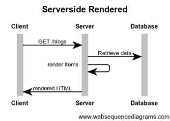
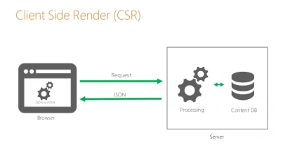

# Server-side rendering (SSR) with Angular Universal

## Cơ chế server-side rendering

Gọi nó là server-side rendering là vì phần lớn logic sẽ được xử lý ở server:

- Khi người dùng vào một trang web, trình duyệt sẽ gửi GET request tới web server
- Web server sẽ nhận request, đọc dữ liệu từ database.
- Web server sẽ render HTML, trả về cho browser để hiển thị cho người dùng

### Ưu điểm

Ra đời đã lâu, server side rendering đã được sử dụng, cải tiến rất nhiều (Caching, CDN). Những ưu điểm của cơ chế này:

- Initial load nhanh, dễ otpimize, vì toàn bộ dữ liệu đã được xử lý ở server. Client chỉ việc hiển thị.
- Các web framework từ xưa đến nay đều hỗ trợ cơ chế này
- Dễ hiểu và dễ code hơn. Developer chỉ cần code 1 project web là được, không cần phải tách ra front-end và back-end
- SEO tốt vì khi bot của Google, Bing vào web sẽ thấy toàn bộ dữ liệu dưới dạng HTML.
- Chạy được trên phần lớn mọi trình duyệt, kể cả disable JavaScript vẫn chạy tốt

### Nhược điểm

- Mỗi lần người dùng chuyển trang là site phải load lại nhiều lần, gây khó chịu
- Tương tác không tốt như Client Side rendering vì trang phải refresh, load lại nhiều lần.
- Nặng server vì server phải xử lý nhiều logic và dữ liệu. Có thể sử dụng caching để giảm tải.
- Tốn băng thông vì server phải gửi nhiều dữ liệu thừa và trùng  (HTML, header, footer). Có thể sử dụng CDN để giảm tải.

## Cơ chế client-side rendering

Thế rồi, ở những năm 2010, với sự phát triển của JavaScript và AJAX, cơ chế client-side rendering bắt đầu được sử dụng.

Developer bắt đầu build ứng dụng dưới dạng SPA – Single Page Application. Ứng dụng nằm trong 1 page duy nhất nên được gọi là Single Page Application.

Client Side Rendering tức là việc render HTML, CSS sẽ được thực hiện ở client (Tức JavaScript ở trình duyệt)

### Ưu điểm

Ra mắt sau nên Client Side Rendering giải quyết được một số vấn đề của server side rendering:

- Page chỉ cần load một lần duy nhất. Khi user chuyển trang hoặc thêm dữ liệu, JavaScript sẽ lấy và gửi dữ liệu từ server qua AJAX. User có thể thấy dữ liệu mới mà không cần chuyển trang.
- Chuyển logic sang client nên giảm tải được một phần cho server.
- Giảm được băng thông do chỉ cần lấy JSON và dữ liệu cần thiết, thay vì phải lấy toàn bộ trang
- Với các ứng dụng cần tương tác nhiều, SPA hoạt động mượt mà hơn vì code chạy trên browser, không cần load đi loại lại nhiều

### Nhược điểm

- Initial load sẽ chậm hơn nếu không biết optimize. Lý do là broser phải tải toàn bộ JavaScript về (khá nặng), parse và chạy JS, gọi API để lấy dữ liệu từ server (chậm), sau đó render dữ liệu
- Đòi hỏi project phải chia làm 2 phần riêng là back-end (REST api) và front-end nên khó code hơn
- Không chạy được nếu JavaScript bị disable, hoặc ở các trình duyệt cũ không nhận JavaScript ES6 (Có thể dùng transpiler và polyfill nhưng sẽ làm tăng kích cỡ file js)
- SEO không tốt bằng Server Side Rendering (Do bot crawl không đọc được dữ liệu). Để giải quyết, ta phải kết hợp thêm SSR (Bot mới của Google đọc được client-side rendering rồi).
Nếu client sử dụng mobile, device yếu thì khi load sẽ bị chậm

## Angular Universal

### What is Angular Universal?

Ứng dụng Angular là một Ứng dụng một trang (single page application) - nó chạy trong trình duyệt của khách hàng. 
Tuy nhiên, bạn cũng có thể chạy ứng dụng Angular của bạn trên server bằng Angular Universal. 

### How does Angular Universal work?

Với Angular Universal, server sẽ hiển thị trước các trang (html css) và hiển thị cho user của bạn nội dung nào đó, trong khi ứng dụng phía client tải ở chế độ nền. 
Sau đó, khi mọi thứ đã sẵn sàng ở phía client, nó sẽ chuyển đổi liền mạch từ hiển thị các trang do server hiển thị sang ứng dụng phía client

### Why Angular Universal?

- Improve performance on mobile and low-powered devices
- Search Engine Optimization (tối ưu hóa công cụ tìm kiếm - SEO)
- Social Media Crawlers (Trình thu thập thông tin truyền thông xã hội)