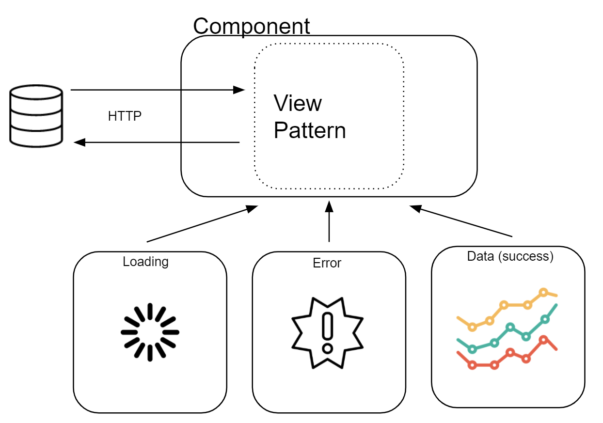

# View State Selector  - Angular design pattern

```html
<div *ngIf="data$ | async as data">
  <ng-container *ngIf="data && !error">
    ...
  </ng-container>
  
  <ng-container *ngIf="error && !loading">
	...
  </ng-container>
  
  <ng-container *ngIf="loading">
	Loading...
  </ng-container>
</div>
```

Đoạn code trên có một main view container, với một số điều kiện để xác định state, một loader template và một khối lệnh xử lí lỗi

> View State Selector là một pattern ràng buộc component state với view template tương ứng. Nói cách khác, nó sẽ tự động inject view template vào một component state cụ thể.

Ví dụ: một component phụ thuộc vào dữ liệu được lấy bởi một yêu cầu HTTP, sẽ bắt đầu với trạng thái loading, sau đó tùy thuộc vào trạng thái đã giải quyết (lỗi hoặc thành công) nó sẽ chuyển sang chế độ xem chính (main view) hoặc chế độ xem lỗi.



## Pattern usage

Việc sử dụng "View State Selector" pattern hơi giống với ngSwitchCase. Cung cấp một state đầu vào và render template phù hơp với state đã cung cấp

```html
<div 
  *viewContainer="view$ | async;
  main mainTmp;
  error errorTmp;
  loading loaderTmp">
</div>

<ng-template #mainTmp let-v="view">...</ng-template>

<ng-template #errorTmp let-v="view">...</ng-template>

<ng-template #loaderTmp>...</ng-template>
```

Trong ví vụ trên, state được biểu diễn bằng view$ observable với 3 trạng thái: main, error và loading. Mỗi trạng thái được liên kết với 1 template sẽ được render theo giá trị view$.

Có một vài tình huống mà pattern này sẽ có lợi hơn so với việc sử dụng ngSwitchCase:
- Pattern này có thể được sử dụng để giảm mã bảng soạn sẵn của các điều kiện xác định mẫu hoạt động (chế độ xem). Các điều kiện này được đóng gói trong viewContainer
- Điều này có thể được thực hiện bằng cách sử dụng đồng thời cả loading state và main view (data).
- Nói chung pattern này sáng cửa hơn cho những states phức tạp, có thể gọi nó là state machine (bộ máy trạng thái)

## Pattern Implementation

**The View in "View State Selector"**

Để đạt được mục tiêu về một pattern có thể sử dụng lại, chúng ta cần bắt đầu bằng cách xác định một giao diện để lưu trữ các state view (trạng thái chế độ xem). Nói chung view là một object đại diện cho các state. 

- **Loading**: là state (trạng thái) trước khi yêu cầu bất đồng bộ được xử lí. Lúc này state sẽ inject *Loader* template
- **Data**: Khi xử thành công, data sẽ được ánh xạ vào *main* template
- **Error**: Nếu yêu cầu thất bại *error* state sẽ chứa lý do lỗi, lúc này error template sẽ được hiển thị
