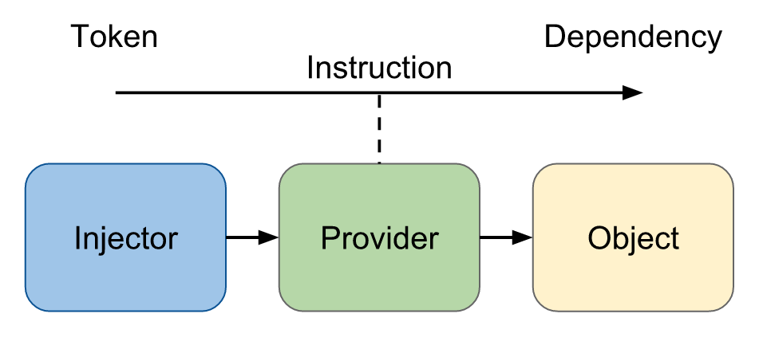

# Day 8: Dependency Injection trong Ứng Dụng Angular

> Dependency Injection là một trong 5 nguyên lý của SOLID

## DI trong Angular

- DI là một kỹ thuật cho phép các đối tượng được cung cấp (hoặc "inject") vào một đối tượng khác một cách tự động.
- Angular sử dụng một trình quản lý DI để cung cấp các đối tượng cho các component, service và các đối tượng khác.

> DI giúp tăng tính khả dụng và dễ bảo trì của mã, bằng cách tách biệt các đối tượng phụ thuộc.

## Các thành phần chính

DI trong Angular bao gồm 3 thành phần sau đây

- `Injector` (container trong tsyringe): có trách nhiệm tạo đối tượng cung cấp service và inject chúng vào Consumer
- `Provider` (register trong tsyringe): giống như một công thức để Injector có thể biết làm thế nào để tạo một instance của một phụ thuộc.
- `Dependency`: là một đối tượng được inject (khởi tạo) vào component (đôi tượng đó có thể là service, function,... nào đó)



### @Injectable() và @Inject()

- `@Injectable()`:
  - **Được sử dụng để khai báo một class có thể được inject thông qua bởi DI**.
  - Khi một class được đánh dấu với @Injectable(), Angular sẽ tạo ra một instance của class đó khi cần thiết.
  - Để sử dụng một service, chúng ta cần đưa nó vào constructor của một component hoặc một service khác và Angular sẽ tự động cung cấp instance của service đó.
  - `providerIn`:
    - `platform`: dùng cho micro-frontend
    - `any`: mỗi module con bên trong modules cha sẽ có một instance khác nhau
    - `root`: cả toàn bộ ứng dụng chỉ có một instance

```TS
// Service
@Injectable()
export class UserService {
  getUser() {
    return { name: 'John', age: 30 };
  }
}

// Component
@Component({
  selector: 'app-user',
  template: '<p>{{user.name}}, {{user.age}}</p>',
})
export class UserComponent {
  user: { name: string, age: number };

  constructor(private userService: UserService) {
    this.user = this.userService.getUser();
  }
}
```

- `@Inject()`:
  - **Được sử dụng để yêu cầu một dependency cụ thể được cung cấp cho một class thông qua DI.**
  - Thông thường, Angular có thể tự động xác định loại dependency mà một class cần, nhưng trong một số trường hợp, chúng ta **cần chỉ định rõ ràng** loại dependency để sử dụng.

```TS
// Service
@Injectable()
export class MyService {
  constructor(@Inject('config') private config: any) {
    console.log(config);
  }
}

// Module
@NgModule({
  providers: [{ provide: 'config', useValue: { setting1: 'value1', setting2: 'value2' } }],
})
export class MyModule {}
```

### Provider in-depth

Chúng ta đã sử dụng provider với cấu trúc của một object với các key provide và useClass như sau.

```ts
{ provide: Computer, useClass: Computer }
```

Ngoài cách trên chúng ta có thể sử dụng một số cách dưới đây:

#### Sử dụng value

```json
// config.json
{
  "apiUrl": "http://myserver.com/api",
  "maxItemsPerPage": 30,
  "theme": "dark"
}
```

```ts
import configData from './config.json';
@NgModule({
  providers: [
    { provide: 'config', useValue: configData }
  ],
})
```

#### Sử dụng alias

Có nhiều token có thể cùng sử dụng một token đã có.

```ts
@NgModule({
  providers: [
    { provide: Computer, useClass: Computer },
    { provide: Server, useExisting: Computer }
  ]
})
```

#### Sử dụng factory

```ts
@Injectable({
  providedIn: "root",
})
export class ConfigService {
  constructor(private http: HttpClient, private apiUrl: string) {}

  getConfig() {
    return this.http.get(this.apiUrl);
  }
}

@NgModule({
  providers: [
    {
      provide: ConfigService,
      useFactory: (http: HttpClient) => {
        const apiUrl = "http://localhost:3000/config"; // Cấu hình tại runtime
        return new ConfigService(http, apiUrl);
      },
      deps: [HttpClient],
    },
  ],
})
export class MyComponent {
  constructor(private configService: ConfigService) {}

  getConfig() {
    this.configService.getConfig().subscribe((config) => {
      console.log(config);
    });
  }
}
```

#### Overrides Provider

```ts
{ provide: 'API_ENDPOINT',  useValue: 'http://blog.com/' },
{ provide: 'API_ENDPOINT',  useValue: 'http://blog2.com/' }
```

- Kết quả cuối cùng của API_ENDPOINT là: 'http://blog2.com/'
- Từ Angular 4 trở đi chúng ta sử dụng InjectionToken để giải quyết vấn đề

```ts
const TOKEN_A = new InjectionToken<string>("token");
const TOKEN_B = new InjectionToken<string>("token");

const s = TOKEN_A === TOKEN_B; // false
```

#### Multiple Provider

Trong trường hợp bạn muốn một token có thể có nhiều value, lúc này bạn có thể sử dụng multiple như sau:

```ts
{
  provide: 'API_ENDPOINT',
  useClass: SupermanService,
  multi: true
},
{
  provide: 'API_ENDPOINT',
  useClass: BatmanService,
  multi: true
},
```

### Các khái niệm liên quan:

- `Inversion of control container`: cách để quản lý container các instance
- `Tsyringe`: thư viện build hệ thống DI trong Angular (thư viện Inversion of control container của microsoft)
