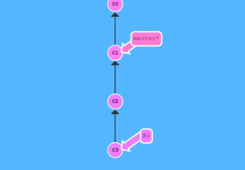

# Cherry pick

- Được sử dụng để chọn lựa và áp dụng các commit cụ thể từ một nhánh sang nhánh hiện tại.
- Thường đứng từ branch main để lấy commit từ branch feature

> git checkout master
> git cherry-pick <commit-hash>

Để cherry pick nhiều commit có thể sử dụng:

> git cherry-pick <commit-hash-1> <commit-hash-2> <commit-hash-3>
> git cherry-pick <commit-hash-1>..<commit-hash-3>

> cherry-pick 1 commit thì lấy đúng hash code của commit đó
> cherry-pick nhiều commit thì lấy hash code của commit trước đó