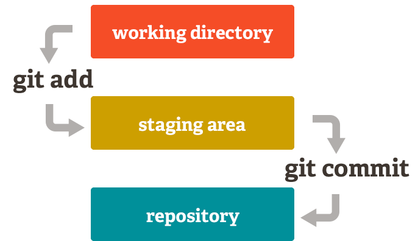

# Git là gì?

## Repo (repository)
- Là một dự chứa toàn bộ source code của dự án.
- Repo có 2 loại (repo dùng để theo dõi lịch sử, mỗi repo là 1 project):
  + `Local repo`: trong máy
  + `Remote repo`: nằm trên máy chủ (có thể pull, push)
- Trong repo thì có rất nhiều commit

## Workflow
- Working directory: thư mục làm việc, nơi xảy ra những thay đổi trong file
- Stating area: Khi `git add` thì những file ở working directory sẽ được add vào stating area này
- Local repo: những thay đổi ở staging area sẽ được đưa vào local repo khi `git commit`
- Remote repo: được dùng để đồng bộ những thay đổi ở local lên remote bằng `git push`, hoặc đồng bộ từ remote về local thì dùng `git pull`

## Commit
Mỗi thay thêm sửa xóa code thì sử dụng commit để update repo

Code change (working directory)
-> git add: để đưa code change vào staging area
-> git commit: để đưa code change vào repo local (chỉ những thằng ở trong staging area mới được commit)

## Các công cụ dùng quản lí Git
- Github
- Gitlab
- Bitbucket

## Thực tế

> git init 
Để tạo một git ở local, có thể thay đổi thông tin trong .git/config như username, email,...

> git status
Để xem sự thay đổi trên local repo, bao gồm file trong working directory, file trong stating,....

> git add
Để đưa những thay đổi ở working dir vào stating area

> git commit
Để đưa những thay đổi ở staging area vào repository

> git commit --amend
Thay đổi message commit

> git push --force
Ghi đè lịch sử  lên remote. **Không nên sử dụng**

> git log

Xem lịch sử của repo